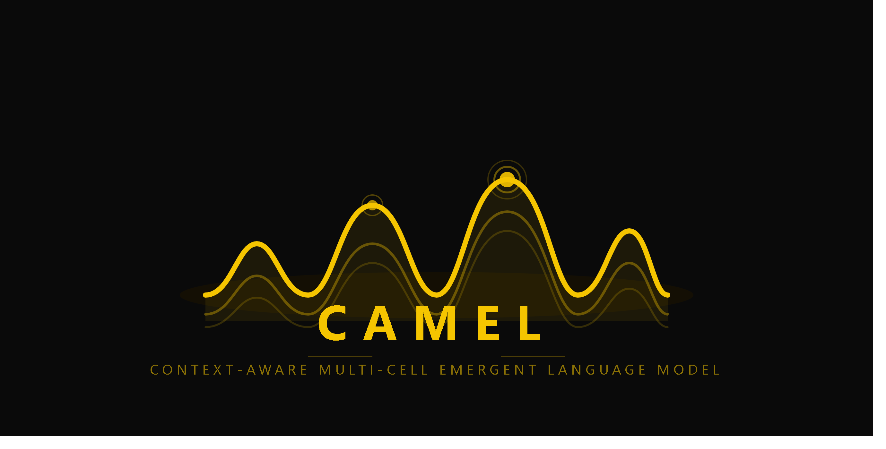

# CAMEL: Context-Aware Multi-cell Emergent Language Model 🐪

*Like a camel surviving efficiently in the desert with limited resources, CAMEL delivers high performance on constrained hardware.*

CAMEL (also formally referred to as MSLM - Multi Small Language Models) is a biologically-inspired, sparse-activation neural architecture. Instead of relying on massive, monolithic dense models where every parameter is fired for every query, CAMEL utilizes a "Gene Map" of knowledge domains to activate only the specific sub-networks required for a given task. 

## 🧠 Architecture Overview

CAMEL separates **Language Understanding** from **Specialized Knowledge**:
*   **Base Cell (Language Core):** `bigscience/bloom-560m`. A foundational model responsible strictly for understanding syntax, grammar, and reasoning logic.
*   **Specialist Cells (Knowledge):** Domain-specific QLoRA adapters (e.g., `code_cell`, `history_cell`, `math_cell`). These contain the actual factual knowledge and are dynamically loaded/merged as needed.

### The Biological Router
Inspired by human brain functions, the Router operates in three distinct tiers:
1.  **Thalamus:** An ultra-fast, zero-parameter $O(N)$ regex-based keyword matrix that provides initial domain hints.
2.  **Prefrontal Cortex (Gating):** Uses weight-tying with the shared embedding layer to calculate cosine similarity between the query and domain centroids. Bypassed if the Thalamus confidence is high enough.
3.  **Hippocampus (Attention Reset):** Maintains conversational context using an Exponential Moving Average (EMA). Crucially, it detects sudden shifts in topic and executes an **Attention Reset** to flush memory and prevent context pollution.

### The Concept Graph & Hebbian Learning
The individual cells are connected via an Adjacency Matrix ($W$). Activation spreads between cells through a fast, branchless matrix multiplication. Over time, the network learns to associate related domains (e.g., Code + Math) via a **One-Shot Hebbian Learning** rule based on the outer product of activations ($C = A_t A_t^T$).

## ⚡ Hardware Efficiency & Constraints

CAMEL was explicitly designed to prove that highly capable AI can run on heavily constrained consumer hardware.

*   **Training & Inference GPU:** NVIDIA Quadro M1200 (4GB VRAM)
*   **Optimization:** Uses `bitsandbytes` 4-bit NormalFloat (`nf4`) quantization with `float16` compute dtype.
*   **Performance:** Achieves a **3.00x Speedup** in latency and a **66.6% Reduction** in active VRAM compared to a dense monolithic baseline of identical parameter count. 

*(See [HARDWARE.md](HARDWARE.md) and the formal paper in `paper/MSLM_paper.md` for full benchmark metrics).*

## 🚀 Getting Started

### 1. Data Preparation
Fetch and clean data from sources (Wikipedia API, Python documentation):
```bash
python prepare.py
```

### 2. Training Specialist Cells
Train individual LoRA adapters on the filtered data:
```bash
python train_cell.py --cell history_cell
python train_cell.py --cell math_cell
python train_cell.py --cell code_cell
```

### 3. Evaluating the Network
Test individual cells or run the full multi-cell biological router pipeline:
```bash
python test_cells.py
python test_network.py
```

## 📈 Research & Documentation
Full empirical results, evaluation logs, and architecture documentation can be found in the `paper/` directory:
*   [MSLM_paper.md](paper/MSLM_paper.md): The primary research paper detailing methodology, theoretical limits, and results.
*   [test_results.md](paper/test_results.md): Raw qualitative outputs of the individual and networked cell tests.

---
*Built with ❤️ in Egypt 🇪🇬*
